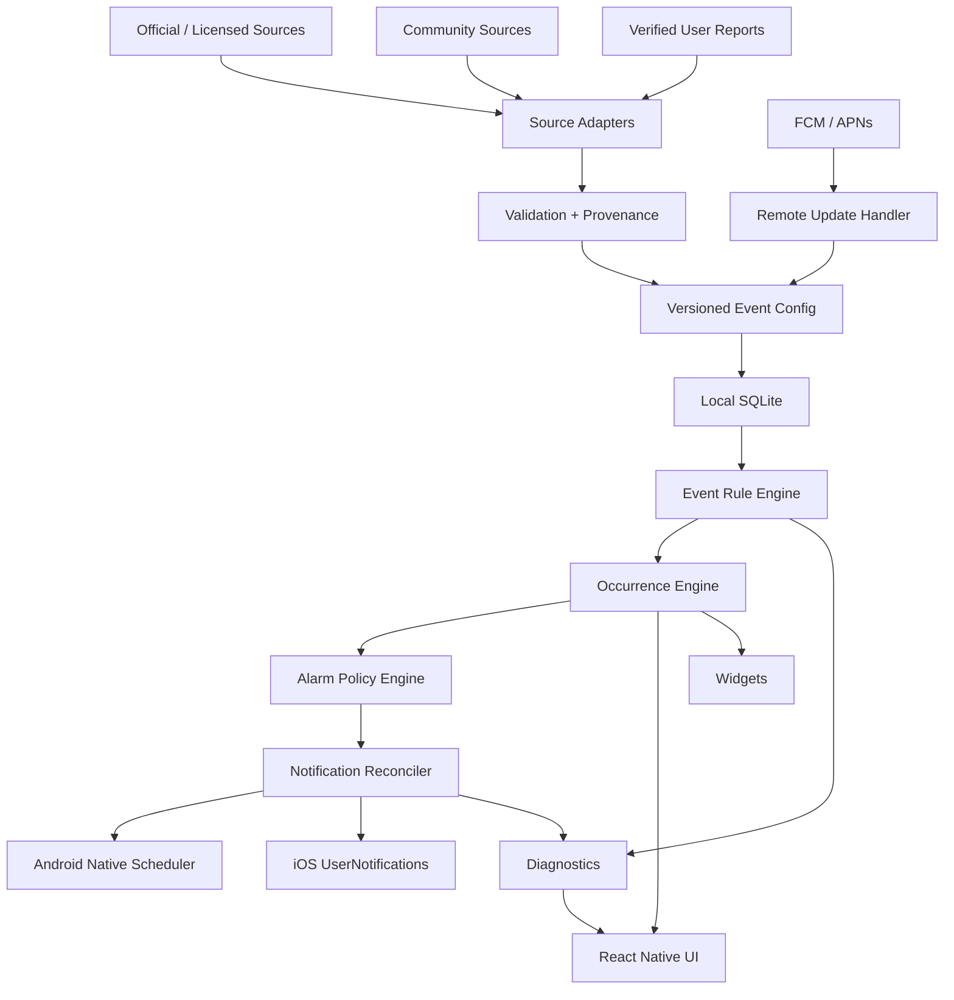

# TGM ALARM CENTER — MASTER-PRODUKTPLAN TRACK A + TRACK B

**Status:** verbindlicher Produkt- und Architekturplan
**Datum:** 2026-09-05
**Geltungsbereich:** gesamtes Repository `famlabsoffice-dev/tgm-alarm-center`
**Source of Truth:** aktueller Branch `main`

## 1. Verbindliche Produktentscheidung

Das Projekt wird ab diesem Dokument dauerhaft in zwei kompatiblen Tracks weiterentwickelt.

### Track A — lizenzierte / offizielle Variante

Ziel: maximal mögliche 1:1-Integration mit der visuellen und markenbezogenen Welt von The Grand Mafia, **nur soweit hierzu eine ausdrückliche, nachweisbare Lizenz, Freigabe oder sonstige ausreichende Berechtigung vorliegt**.

Track A darf verwenden, sofern rechtlich und vertraglich freigegeben:
- offizielle Markenbezeichnungen
- offizielle Logos
- offizielle Spiel- und Event-Assets
- lizenzierte Schriften und Icons
- offizielle Screenshots / Artwork
- eine besonders enge visuelle Integration
- gegebenenfalls offizielle Deep-Link-/Partnerschaftsmechanismen.

Track A ist der Referenzpfad für eine mögliche spätere offizielle Kooperation. Er ist **nicht** Voraussetzung für die Weiterentwicklung des technischen Kerns.

### Track B — eigenständige, maximal ähnliche Companion-Variante

Ziel: dieselbe Informationsqualität, dieselbe Premium-Tiefe und eine visuell sehr nahe, sofort wiedererkennbare Mafia-Command-Center-Erfahrung, jedoch mit vollständig eigenen Assets, eigener Markenidentität und eigener Gestaltung.

Track B verwendet:
- eigene Mafia-/Mansion-Assets
- eigene Icons
- eigene Illustrationen
- eigene Typografie
- eigene Sound Assets
- eigene App-Identität
- eigene UI-Komponenten.

Die visuelle Zielsetzung lautet: **maximale funktionale und atmosphärische Nähe ohne bewusste Täuschung über Herkunft, Autorisierung oder Identität.**

Track B ist der standardmäßige Store-/Produktpfad, solange keine Track-A-Rechte nachweisbar bestehen.

## 2. Markenstrategie

### Primäre Empfehlung für den Endkunden-Namen

**MAFIA COMMAND CENTER**

Untertitel / Produktbeschreibung im Produktmarketing:
**Event & Alarm Companion**

Warum dieser Name:
- „Mafia“ erzeugt sofort die gewünschte thematische Assoziation.
- „Command Center“ kommuniziert die tatsächliche Funktion statt den Eindruck eines Spiels zu erwecken.
- Der Name ist nicht „The Grand Mafia“, „TGM“ oder eine Kopie des Spieltitels.
- Er bleibt auf weitere Mafia-Strategie-Companion-Funktionen erweiterbar.

### Namenshierarchie

Primär:
- Mafia Command Center

Sekundäre Kandidaten für Availability-/Marken-Screening:
- Mafia Event Command
- Underworld Command Center
- Mafia Alert Hub
- Underworld Alert Center
- Crime Boss Command
- Mafia Event Center
- Underworld Event Hub
- Boss Alert Center

Nicht als Primärmarke verwenden, solange keine Freigabe besteht:
- The Grand Mafia Alarm Center
- TGM Alarm Center
- Grand Mafia Alert Hub
- The Grand Mafia Companion
- Official TGM / Official Grand Mafia
- Namen, Logos oder Iconografien, die eine offizielle Beziehung nahelegen.

### Namensprüfung vor Store-Launch

Vor Einreichung müssen mindestens geprüft werden:
- EUIPO
- EU-Markenregister der relevanten Mitgliedstaaten
- WIPO Global Brand Database
- USPTO
- Google Play bestehende App-Namen
- Apple App Store bestehende App-Namen
- Domain- und Social-Handle-Verfügbarkeit.

Die technische Arbeit wird nicht von der offenen Verfügbarkeit eines Namens abhängig gemacht; `Mafia Command Center` ist der derzeitige Arbeits-Branding-Kandidat.

## 3. Visuelle Zielstrategie

### Track A

Wenn lizenziert:
- maximale 1:1-Nähe zum echten TGM-UI
- echte Assets
- originale/llizenzierte Typografie
- originale Event-Card-Sprache
- Spieler-/Mansion-/Event-Center-Hierarchie
- offizielle Icons
- offizielle Motion Language
- gegebenenfalls offizielles Branding.

### Track B

Maximal ähnliche Designprinzipien, aber bewusst eigene Ausführung:
- Obsidian-/Graphitflächen
- Gold-/Bronze-Akzente
- tiefe rote Warnakzente
- schwarze Metallflächen
- realistische Crime-/Mansion-Illustration
- kompakte HUD-artige Informationsdichte
- Event-Hero-Karten
- goldene Progress-Bars
- rote Badges
- dunkle Navigation
- tabellarische Countdowns
- immersive Atmosphere.

Track B darf keine exakte Kopie einzelner TGM-Grafiken, unverwechselbarer Assets oder kompletter geschützter Screens reproduzieren.

## 4. Verbindlicher technischer Produktkern

Das vorhandene Projekt wird nicht neu gebaut. Der vorhandene Domain-, Storage-, Backup- und Notification-Kern wird weiterentwickelt.

Der derzeitige Native-Stack basiert auf Expo 53 / React Native 0.79 / TypeScript und `expo-notifications`. Der vorhandene Notification-Code besitzt bereits Exact-Alarm-Prüfung, Recovery, Notification Ownership, Reconciliation, lokale Sounds und eine serialisierte Scheduling-Queue.

Die gemeinsame Domain-Schicht unterstützt aktuell:
- bubble
- gwBubble
- custom
- individual
- rss
- once
- daily
- gw5d
- warnings
- end-warning
- end
- completed occurrences
- Tier-Limits.

Diese Funktionen bleiben vollständig erhalten.

## 5. Zielarchitektur



## 6. Datenmodell 2.0

### EventDefinition

```ts
interface EventDefinition {
  id: string;
  version: number;
  category: string;
  titleKey: string;
  ruleType: EventRuleType;
  schedule: unknown;
  duration?: unknown;
  variantSource?: unknown;
  seasonScope?: string[];
  criticalMoments: CriticalMomentRule[];
  sources: Provenance[];
  confidence: number;
  effectiveFrom?: string;
  effectiveUntil?: string;
}
```

### EventOccurrence

```ts
interface EventOccurrence {
  id: string;
  definitionId: string;
  definitionVersion: number;
  startUtc: string;
  endUtc: string | null;
  variant: string | null;
  status:
    | 'predicted'
    | 'confirmed'
    | 'communityConfirmed'
    | 'disputed'
    | 'expired';
  confidence: number;
  sourceRefs: string[];
  metadata: Record<string, unknown>;
}
```

### Rule Types

```text
fixedUtc
fixedLocal
dailyLocal
intervalFromAnchor
intervalFromCheckIn
intervalFromCompletion
seasonPhase
eventWindow
manual
dynamicRemote
randomWithinWindow
```

## 7. Event Engine — verbindlicher Ausbau

### P0 deterministische Regeln

- Game Reset: 00:00 UTC
- Personal Event: alle 3 Stunden
- Hell Event: jede volle Stunde, Ende :55
- tägliche persönliche Task-Zeit pro Account
- 6h-Schema für Smuggler / Family / Faction Tasks als Anchor-/Check-in-Intervall
- GW 5-Tage-/Season-Logik
- Massacre Day
- Faction Call Up
- definierte wiederkehrende Eventfenster.

### P0 Random-Event-Modell

Personal- und Hell-Event-Zeitpunkte werden deterministisch erzeugt, der konkrete Eventtyp jedoch separat modelliert.

Beispiel:

```text
Occurrence:
09:00 UTC
Personal Event
variant = unknown
status = predicted
```

Nach Bestätigung:

```text
variant = Construction
status = communityConfirmed
confidence = 0.97
```

Die App darf niemals einen unbestätigten Typ als sicher darstellen.

## 8. TGM-relevante Eventfamilien

Der Zielkatalog umfasst mindestens:

### Globale / individuelle Zeitachsen
- Game Reset
- Personal Event
- Hell Event
- Personal Tasks
- VIP Tasks
- Private Club resets
- Smuggler Tasks
- Family Tasks
- Faction Tasks
- Weapon Trades
- daily / weekly task deadlines.

### Faction
- Faction Call Up
- Restricted Base Siege
- Glory of Oakvale
- Underground Market
- weitere saison- oder remote-konfigurierte Faction Windows.

### Governor's War
- Governor's War
- Governor's War Warm-Up
- The Strongest Leader
- Faction Hegemony
- Massacre Day
- Ressourcen-/Entwicklungs-/Influence-Tage
- saisonabhängige Phasen.

### City
- Battle for City Hall
- City vs City
- The Strongest Leader / City-bezogene Varianten
- zeitkritische Capture-/Battle-Phasen.

### Exploration / Enforcer / Spezialevents
- Abandoned Building Exploration
- Lupo's Operation
- White Dove bezogene Aktivitäten
- Hellcat / Professor bezogene Token-Quellen
- Bone Crusher bezogene GW-Pfade
- Season of Chaos Varianten
- Stained-in-Red und vergleichbare Saisonvarianten.

### Crossover / zeitlich begrenzte Events
- Narcos
- KOF XV
- weitere neue Kollaborationen als Remote Event Definitions.

### Sales / Packs
- Sale Events
- Pack Events
- Premium Dealer / Weapon Emporium / Weapon Trades
- Super Saver / Reward Claim Windows
- weitere dynamische Commerce-/Offer-Fenster, soweit öffentlich und rechtlich zulässig.

## 9. Source-of-Truth für Eventdaten

### Priorität 1
Offizielle Spielquellen:
- Google Play Version History
- App Store Version History
- offizielle Website
- offizielle Facebook/LINE/Discord-Kanäle
- öffentliche Patch Notes
- öffentlich zugängliche In-Game Event Center-/Calendar-Daten, sofern legal und manuell/öffentlich erfassbar.

### Priorität 2
Community:
- TGM Fandom Wiki
- Spieler-Spreadsheets
- Reddit
- Discord
- YouTube-Guides.

### Priorität 3
Eigene Nutzerbestätigungen.

Jeder Eventdatensatz speichert Provenance und Confidence.

## 10. Remote Config

Das Eventsystem wird von App-Releases entkoppelt.

```json
{
  "schema": 3,
  "configVersion": 184,
  "gameVersionRange": ["1.5.0", "1.6.x"],
  "effectiveFrom": "2026-09-01T00:00:00Z",
  "rules": [],
  "signature": "ed25519-signature"
}
```

Remote Config muss:
- signiert sein
- versioniert sein
- abwärtskompatibel sein
- lokal cached werden
- offline weiter funktionieren
- vor Annahme vollständig validiert werden.

## 11. Push-/Alarmarchitektur

### Primär
Lokale native Systemalarme.

### Sekundär
FCM/APNs für:
- neue Eventdefinitionen
- bestätigte Eventvarianten
- Community News
- wichtige serverseitige Config-Updates.

Remote Push darf nicht zur alleinigen Voraussetzung für einen persönlichen Timer werden.

## 12. Android

Beibehalten und erweitern:
- `SCHEDULE_EXACT_ALARM`
- tatsächliche Permission-Prüfung
- Boot Recovery
- Foreground Recovery
- Permission Change Recovery
- Battery Diagnostics
- Notification Channels
- per-alarm ownership
- idempotente Reconciliation.

Zusätzlich:
- Android Widget
- App Shortcut / Quick Action
- Share/Import Receiver nur bei klar definiertem Datenformat.

## 13. iOS

Beibehalten / erweitern:
- lokale Calendar Notifications
- Notification Categories
- Actions
- Notification Service nur bei echtem Bedarf
- Widgets über WidgetKit
- Focus-/Time-Sensitive-kompatible Darstellung.

Critical Alerts nur bei ausdrücklichem Apple-Entitlement.

## 14. Notification Health

Neues Kernmodul:

```text
READY
PERMISSION_REQUIRED
EXACT_ALARM_REQUIRED
BATTERY_RESTRICTION
CLOCK_SUSPECT
RECOVERY_PENDING
RECONCILIATION_REQUIRED
SCHEDULE_ERROR
```

UI:

```text
ALARM PROTECTION

Notifications       ✓
Exact Alarms        ✓
Battery             ✓
Time                 ✓

Scheduled            18
Healthy               18

Last reconciliation
02:41:12

READY
```

## 15. Notification Plan

Jeder Occurrence erzeugt einen Plan:

```text
Occurrence
  ↓
Priority
  ↓
Warnings
  ↓
Start
  ↓
End warnings
  ↓
OS-specific schedule
```

Ownership Key:

```text
alarmId|eventTime|kind|warningMinutes
```

Der bestehende Ownership-/Registry-Ansatz bleibt erhalten und wird auf `occurrenceId` erweitert.

## 16. SQLite-Migration

AsyncStorage bleibt für kleine Preferences geeignet.

SQLite wird Source of Truth für:
- accounts
- alarms
- event definitions
- occurrences
- provenance
- notification registry
- sync cursor
- community submissions
- remote config versions
- app migration state.

Migration muss:
- transaktional
- versioniert
- wiederholbar
- rollback-safe in den unterstützten Grenzen
sein.

## 17. Backup

Backup bleibt vollständig lokal import/export-fähig.

Exportiert werden:
- Accounts
- Alarmprofile
- lokale Alarme
- Notification Preferences
- Watchlists
- lokale User-Event-Anpassungen.

Nicht exportieren:
- Server Secrets
- Push Credentials
- private keys
- signierte Store-Entitlements
- interne Moderationsdaten.

## 18. Security

### Muss
- schema validation
- bounded import sizes
- strict field lengths
- strict color/token validation
- encrypted local sensitive values
- Keychain / Android Keystore
- signed remote config
- token rotation
- rate limiting
- audit logs
- no game credentials.

### Nicht bauen
- Login in The Grand Mafia
- Botting
- Auto-clicking
- Memory manipulation
- packet interception
- hidden game automation.

## 19. UI-Ziel — Mafia Command Center

### Hauptnavigation
- COMMAND
- EVENTS
- GW
- ALARMS
- MORE

### Command Screen

```text
COMMAND CENTER

ACCOUNT
MAIN BOSS

NEXT CRITICAL EVENT

PERSONAL EVENT
01:17:42

HIGH PRIORITY

TODAY
08:00 HELL
09:00 PERSONAL
10:00 HELL
11:00 HELL

GOVERNOR'S WAR
ROUND 4 · DAY 3
INCREASE INFLUENCE

ALARM PROTECTION
██████████ 100%
READY
```

### UI-Gestaltung Track B

- neue eigene Mafia-Hero-Illustrationen
- eigener Mansion-Hintergrund
- eigene Gold-/Bronze-Rahmen
- eigene Event-Icons
- eigene Badges
- eigene Icons und Shapes
- eigene typografische Behandlung.

### UI-Gestaltung Track A

Bei Lizenz exakt die vereinbarten offiziellen Assets einsetzen.

## 20. Design Tokens Track B

```text
Background: #0B0D0F
Panel: #121416
Raised Panel: #191C1F
Bronze: #7A592D
Gold: #D1A84D
Gold Highlight: #E4C16A
Danger: #A62B2B
Deep Red: #6F1C1C
Text: #EEE8DB
Secondary Text: #B6B1A5
Muted: #78756E
```

Diese Werte sind eigene Produkt-Tokens und keine Behauptung, die internen Originalwerte des Spiels zu reproduzieren.

## 21. Personalisierung

Jeder Account erhält:
- individuelle Alarmprofile
- eigene Prioritätsregeln
- eigener Task-Reset
- eigene 6h-Anchor-Zeiten
- Watchlist
- Soundprofil
- Vibrationsregel
- optionales Quiet Window.

## 22. Smart Alert Modes

### MAX
Alle relevanten Hinweise.

### BALANCED
wichtige Warnungen, intelligente Gruppierung.

### MINIMAL
nur Start / Ende / kritische Events.

## 23. Widgets

### Small
Next Event + Countdown.

### Medium
Next Event + GW status.

### Large
Today timeline + next critical event.

## 24. Community Event Intelligence

User Reports:
- Eventtyp bestätigen
- Eventtyp korrigieren
- Start-/Ende bestätigen
- optional Beleg/Referenz.

Reputation:
- Anzahl bestätigter korrekter Meldungen
- Konsistenz
- unabhängige Bestätigungen.

Konflikte werden nicht blind überschrieben.

## 25. Faction / Group Board — Phase 3

```text
FACTION COMMAND

NEXT EVENT
UNDERGROUND MARKET
01:12:44

GW
DAY 3

TEAM TARGET
2,400,000

CURRENT
1,870,000
```

Optional später:
- gemeinsame Kalender
- Rollen
- R4/R5 Event Notices
- gruppenbezogene Reminder.

## 26. Pricing / Entitlements

Aktuelles Tiermodell bleibt fachlich erhalten, wird aber strikt von der technischen Event Engine getrennt.

Produktionsentitlements:
- Store Purchase
- Store Receipt / Transaction Validation
- serverseitig signiertes Entitlement
- lokal gecachter, verifizierter Status.

Founder-/Team-Testzugänge bleiben als separater Testmechanismus bestehen und werden nie als Ersatz für Store Billing eingesetzt.

## 27. Roadmap

### Phase 0 — Brand, IP, Research
- Namen screenen
- Track A/B Design Rules festschreiben
- Event Source Registry
- Event Catalogue
- Design System
- Screen Map
- Legal/Store Gate.

### Phase 1 — Event Intelligence Core
- EventDefinition
- EventOccurrence
- deterministic UTC rules
- Personal/Hell
- Personal reset
- 6h anchors
- GW
- Faction
- City
- seasons
- random variants
- provenance.

### Phase 2 — Native Reliability
- SQLite
- exact alarm
- boot recovery
- permission recovery
- iOS scheduling
- health center
- reconciliation
- notification actions.

### Phase 3 — Premium UX
- Command Center
- GW Center
- Event Center
- widgets
- smart alert modes
- personalization
- themes.

### Phase 4 — Community Intelligence
- remote config
- verified submissions
- confidence system
- moderation
- community event status.

### Phase 5 — Commerce / Scale
- verified entitlements
- analytics
- monitoring
- crash reporting
- CDN/config distribution
- regional rollout.

### Phase 6 — Bestseller Polish
- motion
- microinteractions
- accessibility
- localization
- onboarding optimization
- ASO
- community growth.

## 28. QA Gates

### P0
- no duplicate notifications
- no cross-account notifications
- deterministic event time correctness
- GW boundary correctness
- exact alarm status correctness
- boot recovery
- permission recovery
- backup recovery.

### P1
- DST matrix
- timezone changes
- device sleep
- battery optimization
- app update
- network loss
- remote config rollback
- conflict resolution.

### P2
- accessibility
- localization
- animation regression
- widget consistency.

## 29. Reliability SLO

Engineering target:

**>=99.5% qualified notification delivery** under defined test conditions and with required OS permissions active.

Zusätzlich:
- crash-free sessions >=99.8%
- duplicate alarm rate ~0
- event schedule reconstruction = 100%
- account isolation = 100%
- backup validation = 100% valid fixtures.

## 30. Source Evidence / external constraints

The current public game listing identifies The Grand Mafia as a Phantix Games product and shows current 2026 updates. The community Daily Schedule documents 00:00 UTC reset, personal-task reset behavior, six-hour task timing, three-hour Personal Events and hourly Hell Events. Apple and Google both explicitly prohibit deceptive impersonation/copycat presentation and unauthorized use of third-party IP in store apps. These constraints are incorporated into Track A/Track B by design.

Primary/secondary references:
- https://play.google.com/store/apps/details?id=com.yottagames.gameofmafia
- https://apps.apple.com/de/app/the-grand-mafia/id1471493354
- https://tgm.fandom.com/wiki/Daily_Schedule
- https://tgm.fandom.com/wiki/Governor%27s_War
- https://tgm.fandom.com/wiki/Faction_Call_Up
- https://tgm.fandom.com/wiki/EVENT_ENFORCERS
- https://developer.apple.com/app-store/review/guidelines/
- https://support.google.com/googleplay/android-developer/answer/9888374
- https://support.google.com/googleplay/android-developer/answer/9888072
- https://developer.android.com/develop/background-work/services/alarms
- https://developer.apple.com/documentation/usernotifications/uncalendarnotificationtrigger

## 31. Verbindliche Integrationsregel

Jede künftige Erweiterung des Projekts muss beide Tracks mitdenken:

1. technische Kernlogik darf niemals von einem bestimmten Brand Asset abhängen;
2. Event Engine, alarms, scheduling, persistence und data contracts sind brand-neutral;
3. Track A und Track B teilen dieselbe Domain- und Reliability Engine;
4. nur Branding-/Asset-/UI-Layer unterscheiden sich;
5. keine Funktion darf nur für eine Track-Variante existieren, wenn sie fachlich allgemeiner Kern ist;
6. neue TGM-Events werden als Daten/Regeln integriert, nicht als hartcodierte UI-Sonderfälle;
7. neue Game-Versionen werden über versionierte Configs absorbiert;
8. Store-Identität bleibt ehrlich und darf keine offizielle Beziehung vortäuschen.

## 32. Zielzustand

```text
Mafia Command Center
        |
        +-- Event Intelligence
        +-- Personal Timers
        +-- TGM-oriented Event Rules
        +-- Governor's War Engine
        +-- Smart Alarm Engine
        +-- Native Notifications
        +-- Notification Health
        +-- Widgets
        +-- Community Confirmation
        +-- Offline First
        +-- Optional Sync
        +-- Verified Entitlements
        +-- Track A Licensed UI
        +-- Track B Independent UI
```

**Dieses Dokument ist die verbindliche dauerhafte Integrationsplanung für Track A und Track B und gilt ab 2026-09-05 als Erweiterung des bestehenden TGM Alarm Center Masterplans.**
